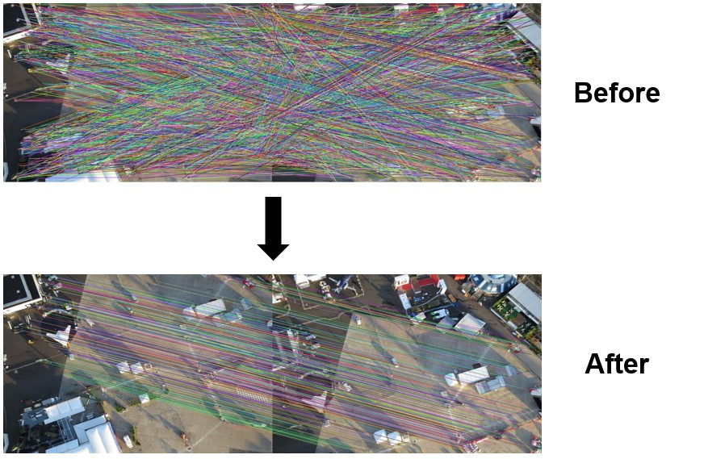

# MS-RANSAC
Fast and Accurate Early Termination RANSAC for Image Feature Matching Using Machine Learning-Based Reliable Correspondence Set by Kuo-Liang Chung, Chia-Chi Hsu, and Yu-Chi Chang.

A C++ implementation of the GH-COOSAC method for removing mismatches in image feature matching.

# Dependencies
* OpenCV 4.8.0

# Testing enviroment
* Windows 10
* Visual Studio 2022
* C++ 14

# Contact
If you have any questions, please email us via

Chia-Chi Hsu: <m11115040@mail.ntust.edu.tw>

Kuo-Liang Chung: <klchung01@gmail.com>

